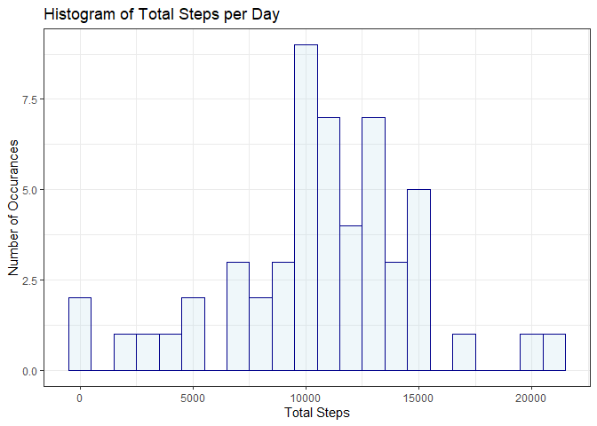

## Loading and preprocessing the data

In this section we will check to see if the package is downloaded from the course site, unzip it, and read the csv into R.


```r
fileName <- "repdata_data_activity.zip"

chk <- file.exists(fileName)

if (chk == TRUE){
  print("The req'd file exists")
  unzip(fileName, overwrite = TRUE)
  print("File has been unzipped")
} else {
  print("The req'd file does not exist")
  print("Consult the guide to source the req'd file")
}
```

```
## [1] "The req'd file exists"
## [1] "File has been unzipped"
```

```r
data <- read.csv("activity.csv")
```

## What is mean total number of steps taken per day?

In this portion, we will look at the average number of steps taken, per day, ignoring the NA values, this result will be graphed.  The mean and median for the steps taken per day will also be reported.


```r
library(ggplot2)

totStepsPerDay <- aggregate(data$steps, by =list(data$date),FUN=sum)
names(totStepsPerDay) <- c("Date", "Total_Steps")

avgSteps <- mean(totStepsPerDay$Total_Steps, na.rm = TRUE)
medSteps <- median(totStepsPerDay$Total_Steps, na.rm = TRUE)

ggplot(data=totStepsPerDay, aes(Total_Steps)) +                              geom_histogram(binwidth=1000, na.rm = TRUE, fill="light blue",               color="dark blue", alpha = .2) +
  theme_bw() +
  labs(title="Histogram of Total Steps per Day") +
  labs(x="Total Steps", y="Number of Occurances")
```

<!-- -->

```r
# I would have exho off'd this code, it makes the doc noisy
print(paste("The average daily steps taken: ", avgSteps))
```

```
## [1] "The average daily steps taken:  10766.1886792453"
```

```r
print(paste("The median number of daily steps taken: ", medSteps))
```

```
## [1] "The median number of daily steps taken:  10765"
```

## What is the average daily activity pattern?

For this portion, we will provide a time series plot of the average number of steps taken in the 5 minute interval over for all the days.  If the question is understood correctly, for a given interval on the x-axis, we will be plotting the average number of steps taken in all the days.

Using these results, idenify the 5 minute interval where the maximum number of steps occurs.


```r
avgStepsPerInt <- aggregate(data$steps, na.rm = TRUE, 
   by =list(data$interval),FUN=mean)
names(avgStepsPerInt) <- c("Interval", "Average_Steps")

maxSteps <- max(avgStepsPerInt$Average_Steps)
maxInterval <- avgStepsPerInt[avgStepsPerInt$Average_Steps >= maxSteps, ]

ggplot(data=avgStepsPerInt, aes(x=Interval, y=Average_Steps)) +
  geom_line(na.rm = TRUE, color = "dark green") +
  geom_vline(xintercept = maxInterval[1,1], color = "dark red") +
  labs(title="Average Steps per Interval") +
  labs(x="Interval", y="Average Steps") +
  theme_bw()
```

<!-- -->

```r
print(paste("The interval with the maximum average steps: ",                  maxInterval$Interval))
```

```
## [1] "The interval with the maximum average steps:  835"
```

```r
print(paste("The maximum average number of steps: ",                          maxInterval$Average_Steps))
```

```
## [1] "The maximum average number of steps:  206.169811320755"
```

## Imputing missing values

We will identify the number of missing values. Then impute values into those missing values 


```r
library(dplyr)
```

```
## 
## Attaching package: 'dplyr'
```

```
## The following objects are masked from 'package:stats':
## 
##     filter, lag
```

```
## The following objects are masked from 'package:base':
## 
##     intersect, setdiff, setequal, union
```

```r
data2 <- data
missing <- sum(is.na(data2$steps))
print(paste("The number of NA's Before: ", missing))
```

```
## [1] "The number of NA's Before:  2304"
```

```r
repl <- data2 %>%
          group_by(interval) %>%
          summarise(meanInterval = mean(steps, na.rm = TRUE))
repl <- as.data.frame(repl)

data2 <- merge(data2, repl, by="interval", order_by="date")

data2$steps <- ifelse(is.na(data2$steps), data2$meanInterval,               data2$steps)

data2 <- data2[1:3]

data2$date <- as.Date(data2$date, "%Y-%m-%d")
data2 <- data2[order(as.Date(data2$date, format="%Y-%m-%d")),]

missing <- sum(is.na(data2$steps))
print(paste("Total number of NA's after: ", missing))
```

```
## [1] "Total number of NA's after:  0"
```

```r
totStepsPerDay2 <- aggregate(data2$steps, by =list(data2$date),FUN=sum)
names(totStepsPerDay2) <- c("Date", "Total_Steps")

avgSteps2 <- mean(totStepsPerDay2$Total_Steps)
medSteps2 <- median(totStepsPerDay2$Total_Steps)

ggplot(data=totStepsPerDay2, aes(Total_Steps)) +                           geom_histogram(binwidth=1000, na.rm = TRUE, fill="light blue", color="dark blue", alpha = .2) +
  theme_bw() +
  labs(title="Histogram of Total Steps per Day - NA's Replaced with Interval Average") +
  labs(x="Total Steps", y="Number of Occurances")
```

<!-- -->

```r
# I would have echo off'd this code, it makes the doc noisy
avgSteps2 <- mean(totStepsPerDay2$Total_Steps)
print(paste("The average daily steps taken: ", avgSteps2))
```

```
## [1] "The average daily steps taken:  10766.1886792453"
```

```r
medSteps2 <- median(totStepsPerDay2$Total_Steps)
print(paste("The median number of daily steps taken: ", medSteps2))
```

```
## [1] "The median number of daily steps taken:  10766.1886792453"
```

There was very little difference between when the NA's were dropped and the NA's were exchanged for the average interval value.  The average (mean) is identical, but the median more closely fits the mean.

## Are there differences in activity patterns between weekdays and weekends?


